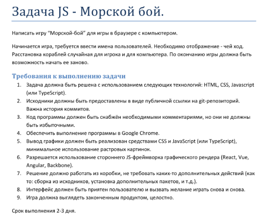

Тестовое задание от Tensor UFA

Написать игру “Морской-бой” для игры в браузере с компьютером.
Начинается игра, требуется ввести имена пользователей. Необходимо отображение - чей ход.
Расстановка кораблей случайная для игрока и для компьютера. По окончанию игры должна быть
возможность начать ее заново.

